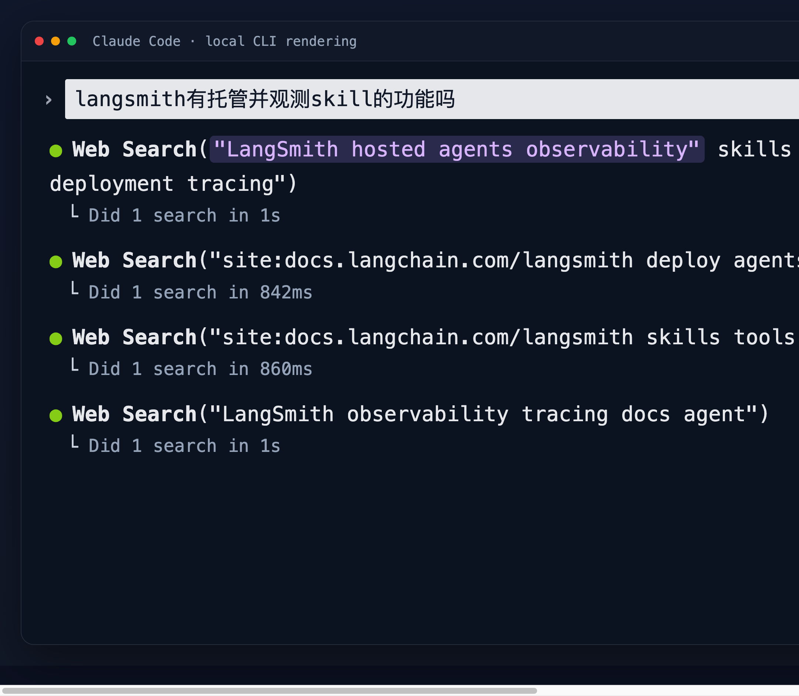
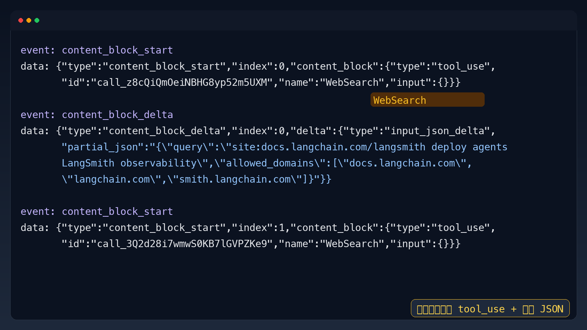

# Claude Code 里的 WebSearch：模型在输出什么，CLI 又渲染了什么

> 来源：基于本次会话中的真实终端截图、SSE 抓包片段与交互分析整理
> 记录时间：2026-07-22

---

## 核心观点

Claude Code 终端里看到的 `Web Search("...")`、`Did 1 search in 1s` 这类内容，不是大模型原样流式吐出来的文本，而是 **Claude Code 本地 harness / CLI 根据模型的 `tool_use` 事件做的可视化渲染与执行反馈**。模型真正输出到 SSE 里的，通常是 `tool_use` 块、工具名以及分段流出的 JSON 入参。

---

## 为什么值得看

很多人第一次抓 Claude Code 的包，都会有一个困惑：

- 为什么代理里只看到 `tool_use`、`input_json_delta`
- 但终端里却能看到 `Web Search("...")`
- 甚至还有 `Did 1 search in 1s` 这样的执行结果摘要

如果这层没分清，就很容易把“模型协议层输出”和“CLI 本地 UI 层渲染”混为一谈。理解这点之后，你会更容易看懂：

- Claude Code 的工具调用链路
- Anthropic Messages SSE 流到底返回了什么
- 一个 agent runtime 是怎么把协议层事件变成人类可读的终端体验的

---

## 关键概念拆解

### 1. 模型负责“提出工具调用”

当模型判断当前问题需要搜索，它不会直接返回一段“我现在去搜一下”的普通文本，而是会在响应流里产出一个结构化的 `tool_use` 内容块。

这类 SSE 事件常见形态是：

- `content_block_start`
- `content_block_delta`
- `content_block_stop`
- `message_delta`（其中可能带 `stop_reason: "tool_use"`）

也就是说，**模型输出的是“我要调用哪个工具，以及这个工具的参数是什么”**。

### 2. Claude Code 负责“拼参数并执行工具”

SSE 里的参数不是一次性完整给出的，而是经常拆成多段 `input_json_delta` 流出来。

Claude Code 本地 runtime 会把这些碎片拼成完整 JSON，例如：

```json
{
  "query": "site:docs.langchain.com/langsmith deploy agents LangSmith observability",
  "allowed_domains": ["docs.langchain.com", "langchain.com", "smith.langchain.com"]
}
```

然后由 Claude Code 本地 harness 去执行这个名为 `WebSearch` 的工具。

### 3. 终端里的 `Web Search("...")` 是本地 prettify 结果

CLI 不会把底层协议原样展示给用户，而是会做一层“可读化”处理，例如：

- `WebSearch` → `Web Search`
- 从参数里提取 `query`
- 渲染成 `Web Search("...")`

所以：

- **协议层**看到的是 `name: "WebSearch"`
- **终端层**看到的是 `Web Search("...")`

两者表达的是同一件事，但一个偏机器可读，一个偏人类可读。

### 4. `Did 1 search in 1s` 属于执行反馈，不属于模型原始 token

这类信息只有在工具真正执行完后，Claude Code 本地才知道：

- 一共执行了几次 search
- 花了多久
- 是成功还是失败

因此它不可能在模型刚发出 `tool_use` 时就出现在 SSE 流里。

更准确地说：

- `tool_use` 是**模型输出**
- `Did 1 search in 1s` 是**本地工具执行后的 UI 汇总**

### 5. 工具结果还会再回注给模型

Claude Code 工具执行完成后，不会只在终端打印一下就结束，而是会把搜索结果再作为后续上下文喂回模型，让模型继续生成答案。

所以一个完整循环更像：

1. 用户提问
2. 模型输出 `tool_use(WebSearch)`
3. Claude Code 本地执行 WebSearch
4. 工具结果回注给模型
5. 模型基于结果继续回答

### 6. 这类 WebSearch 是 Claude Code 本地工具循环，不是同一种 server-side web search 形态

你这次抓到的是 Claude Code 自己的工具调度链路，因此流里出现的是 `tool_use`。

如果换成另一种“由 API 平台直接托管执行”的搜索工具，协议层形态会不同，不一定还是这套本地 harness 的表现方式。

所以这里最稳的理解是：

> **本次看到的 WebSearch，是 Claude Code runtime 暴露给模型的工具；模型发出结构化 tool call，本地 CLI 执行并把执行状态渲染给你看。**

---

## 重点对比表

| 维度 | 模型 SSE 里能看到 | Claude Code 终端里能看到 | 我的理解 |
|------|-------------------|--------------------------|----------|
| 工具名 | `WebSearch` | `Web Search` | CLI 做了名字 prettify |
| 工具参数 | `input_json_delta` 分段 JSON | `("query")` 摘要化展示 | CLI 从完整 JSON 里抽重点参数展示 |
| 执行耗时 | 通常看不到 | `Did 1 search in 1s` | 这是本地执行反馈，不是模型 token |
| 结果状态 | 需要后续 tool result / 下一轮请求才能看到 | 终端会立刻给用户执行态提示 | UI 层比 raw SSE 更接近“操作日志” |
| 协议层结构 | `content_block_start/delta/stop` | 基本被隐藏 | CLI 把协议事件翻译成可读界面 |
| 语义归属 | 模型在请求工具 | 本地在执行工具并展示进度 | 决策与执行分层 |

---

## Demo 1：终端里看到的是什么

### 用户输入

```text
langsmith有托管并观测skill的功能吗
```

### Claude Code 终端渲染

```text
Web Search("LangSmith hosted agents observability skills LangGraph Platform deployment tracing")
  Did 1 search in 1s

Web Search("site:docs.langchain.com/langsmith deploy agents LangSmith observability")
  Did 1 search in 842ms
```

### 这段内容的正确理解

- `Web Search("...")`：CLI 从 `tool_use.name + input.query` 渲染出来的可读日志
- `Did 1 search in 1s`：Claude Code 本地执行工具后的统计摘要
- 这两段都**不是模型自然语言输出正文**

### Demo 图片



---

## Demo 2：SSE 抓包里看到的是什么

### 典型 SSE 片段

```text
event: content_block_start
data: {"type":"content_block_start","index":0,"content_block":{"type":"tool_use","id":"call_z8cQiQmOeiNBHG8yp52m5UXM","name":"WebSearch","input":{}}}

event: content_block_delta
data: {"type":"content_block_delta","index":0,"delta":{"type":"input_json_delta","partial_json":"{\"query\":\"site:docs.langchain.com/langsmith deploy agents LangSmith observability\",\"allowed_domains\":[\"docs.langchain.com\",\"langchain.com\",\"smith.langchain.com\"]}"}}
```

### 这段内容的正确理解

这代表的是：

- 模型正在输出一个 `tool_use`
- 工具名是 `WebSearch`
- 入参 JSON 正在流式增量返回

这里还**没有**“Did 1 search in 1s”这种信息，因为此时工具还没执行完。

### Demo 图片



---

## 一张时序图看懂整个链路

```text
用户提问
  ↓
Claude Code 发起 Messages 请求
  ↓
模型 SSE 输出 tool_use(WebSearch) + input_json_delta
  ↓
Claude Code 本地拼出完整 JSON 参数
  ↓
Claude Code 本地执行 WebSearch 工具
  ↓
CLI 渲染：Web Search("...") / Did 1 search in 1s
  ↓
Claude Code 把 tool result 回注给模型
  ↓
模型继续生成最终答案
```

---

## 要点整理

### 一、你抓到的 SSE 是“模型协议层”

这层应该用“事件流”的方式来读：

- `message_start`
- `content_block_start`
- `content_block_delta`
- `content_block_stop`
- `message_delta`
- `message_stop`

如果遇到 `tool_use`，就代表模型本轮不只是输出文本，而是在发起一个结构化工具调用。

### 二、终端上的工具日志是“本地 UI 层”

CLI 会根据协议层内容做很多本地加工：

- 工具名 prettify
- 参数摘要
- 执行耗时统计
- 结果层级缩进
- 颜色和图标

所以终端日志比 raw SSE 更适合人读，但也更“二次加工”。

### 三、判断一段内容属于哪一层，有个简单经验法则

如果它长得像协议字段：

- `content_block_start`
- `tool_use`
- `input_json_delta`
- `partial_json`

那它大概率是**模型 / API 协议层输出**。

如果它长得像操作日志：

- `Web Search("...")`
- `Read(file.ts:12-30)`
- `Bash(git status)`
- `Did 1 search in 1s`

那它大概率是**Claude Code 本地 CLI 渲染结果**。

### 四、不要把“模型能看到什么”和“用户终端显示什么”混成一件事

在 agent 系统里，这两层经常不同：

- 模型看到的是结构化协议
- 用户看到的是产品层加工后的可读界面

理解这个分层，对调试代理、写兼容层、做抓包分析都非常关键。

---

## 我的总结

如果只记住一件事，那就是：**Claude Code 终端里的 `Web Search("...")` 是本地 UI 对 `tool_use(WebSearch)` 的可读化呈现，而不是模型原样流式输出的文本；真正来自模型流的是 `tool_use` 块及其增量 JSON 参数。**

再说得更工程一点：

> **模型负责决策，Claude Code 负责执行；SSE 负责传协议，CLI 负责做人类可读渲染。**

---

## 原文链接

> 仅存于本地笔记，发布时绝不带出（本条为会话内素材，无外部 URL）

- 来源：本次会话中关于 Claude Code 与模型交互 WebSearch 原理的问答
- 素材 1：终端截图，展示 `Web Search("...")` 与 `Did 1 search in 1s`
- 素材 2：SSE 抓包截图，展示 `tool_use(name=WebSearch)` 与 `input_json_delta`
- 关键线索：模型流里只有结构化 `tool_use` 事件；终端里的人类可读操作日志由 Claude Code 本地渲染生成
